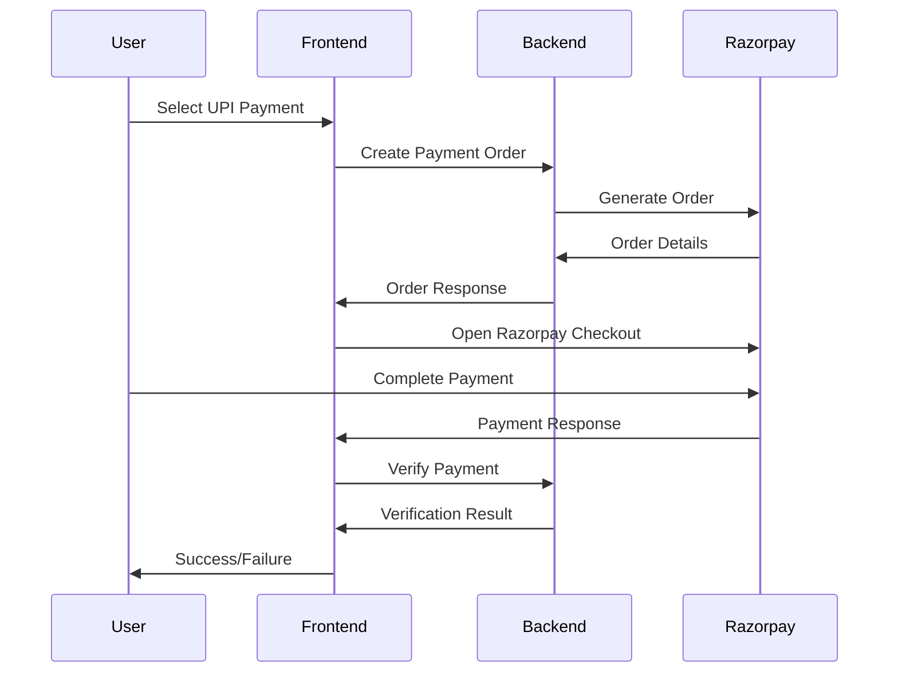

# Payment Gateway Setup Guide

## 🚀 Razorpay Integration for VapeGuard Insurance Portal

This guide will help you set up Razorpay payment gateway for UPI, PhonePe, GPay, and Paytm payments.

## 📋 Prerequisites

1. **Razorpay Account**: Sign up at [razorpay.com](https://razorpay.com)
2. **API Keys**: Get your Test/Live API keys from Razorpay Dashboard
3. **Node.js & npm**: Ensure both frontend and backend dependencies are installed

## 🔧 Setup Instructions

### 1. Backend Configuration

1. **Install Dependencies** (already done):
   ```bash
   cd vape-insurance-backend
   npm install razorpay
   ```

2. **Environment Variables**:
   ```bash
   # Copy example file
   cp .env.example .env
   
   # Edit .env file with your Razorpay credentials
   RAZORPAY_KEY_ID=rzp_test_your_key_id_here
   RAZORPAY_KEY_SECRET=your_key_secret_here
   RAZORPAY_WEBHOOK_SECRET=your_webhook_secret_here
   ```

### 2. Frontend Configuration

1. **Install Dependencies** (already done):
   ```bash
   cd vape-insurance-portal
   npm install razorpay
   ```

2. **Environment Variables**:
   ```bash
   # Copy example file
   cp .env.example .env
   
   # Edit .env file
   REACT_APP_API_URL=http://localhost:5000
   REACT_APP_RAZORPAY_KEY_ID=rzp_test_your_key_id_here
   ```

## 🔑 Getting Razorpay Credentials

### Test Mode (Development)
1. Login to [Razorpay Dashboard](https://dashboard.razorpay.com)
2. Go to **Settings** → **API Keys**
3. Generate **Test Keys**
4. Copy **Key ID** and **Key Secret**

### Live Mode (Production)
1. Complete KYC verification
2. Generate **Live Keys**
3. Update environment variables with live credentials

## 💳 Supported Payment Methods

| Method | Status | Description |
|--------|--------|-------------|
| **UPI** | ✅ Enabled | Any UPI app (BHIM, PhonePe, GPay, etc.) |
| **PhonePe** | ✅ Enabled | PhonePe wallet |
| **Google Pay** | ✅ Enabled | Google Pay wallet |
| **Paytm** | ✅ Enabled | Paytm wallet |
| **Net Banking** | ✅ Enabled | Bank transfer (fallback) |
| **Cards** | ❌ Disabled | As per requirements |

## 🧪 Testing

### Test Payment Flow
1. **Start Backend**:
   ```bash
   cd vape-insurance-backend
   npm start
   ```

2. **Start Frontend**:
   ```bash
   cd vape-insurance-portal
   npm start
   ```

3. **Test Scenarios**:
   - Fill personal details
   - Select insurance plan
   - Choose UPI payment method
   - Complete payment flow

### Test UPI IDs (Razorpay Test Mode)
```
success@razorpay - Successful payment
failure@razorpay - Failed payment
```

### Test Cards (if enabled)
```
Card Number: 4111 1111 1111 1111
Expiry: Any future date
CVV: Any 3 digits
```

## 🔄 Payment Flow



## 🛠 Troubleshooting

### Common Issues

1. **"Razorpay SDK not loaded"**
   - Ensure `<script src="https://checkout.razorpay.com/v1/checkout.js"></script>` is in `index.html`

2. **"Invalid API Key"**
   - Check `RAZORPAY_KEY_ID` in both frontend and backend `.env` files
   - Ensure no extra spaces or quotes

3. **"Payment Order Creation Failed"**
   - Verify `RAZORPAY_KEY_SECRET` in backend `.env`
   - Check backend logs for detailed error

4. **CORS Issues**
   - Ensure `FRONTEND_URL` is set correctly in backend `.env`
   - Check CORS configuration in `server.js`

### Debug Mode
Enable detailed logging by setting:
```bash
# Backend
DEBUG=razorpay:*

# Frontend (browser console)
localStorage.setItem('debug', 'payment:*')
```

## 📊 Monitoring & Analytics

### Razorpay Dashboard
- View all transactions
- Monitor success/failure rates
- Download settlement reports
- Set up webhooks for real-time updates

### Application Logs
- Payment attempts logged in MongoDB
- Error tracking in backend logs
- Frontend payment events in browser console

## 🔒 Security Best Practices

1. **Never expose Key Secret** in frontend code
2. **Use HTTPS** in production
3. **Implement webhook verification** for payment confirmations
4. **Validate payment amounts** on backend
5. **Store sensitive data encrypted** in database

## 💰 Pricing (Razorpay)

| Transaction Type | Fee |
|------------------|-----|
| UPI | 2% |
| Wallets | 2% |
| Net Banking | 2% |

*Fees may vary based on volume and negotiated rates*

## 📞 Support

- **Razorpay Support**: [support.razorpay.com](https://support.razorpay.com)
- **Documentation**: [razorpay.com/docs](https://razorpay.com/docs)
- **Integration Issues**: Check backend/frontend logs

## 🚀 Going Live

1. Complete Razorpay KYC verification
2. Generate Live API keys
3. Update environment variables
4. Test with small amounts
5. Monitor transactions closely
6. Set up webhook endpoints for production

---

**Note**: This integration is configured for Indian market with INR currency. For international payments, additional configuration may be required.
