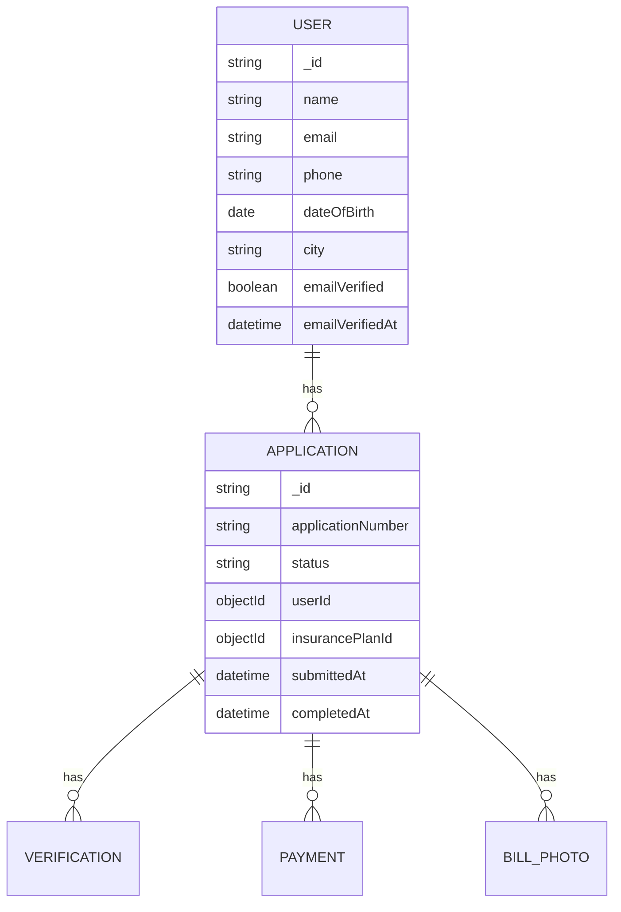

# 🛡️ VapeGuard Insurance Portal

[](https://opensource.org/licenses/MIT)
[](https://nodejs.org/)
[](https://reactjs.org/)
[](https://www.mongodb.com/)

A comprehensive insurance platform designed specifically for vape users, offering specialized health coverage and wellness benefits.

## ✨ Features

- **Multi-step Application Process**
  - Personal details collection
  - Insurance plan selection
  - Secure payment processing
  - Document upload and verification

- **Secure Authentication**
  - Email verification with OTP
  - Phone verification
  - JWT-based session management

- **Payment Integration**
  - Multiple payment methods (UPI, Net Banking, Wallets)
  - Secure transaction processing
  - Payment status tracking

- **User Dashboard**
  - Application status tracking
  - Policy documents
  - Claim submission
  - Support and help center

## 🚀 Quick Start

### Prerequisites

- Node.js 18.x or later
- MongoDB 6.0 or later
- npm or yarn

### Installation

1. **Clone the repository**
   ```bash
   git clone https://github.com/yourusername/vape-guard-app.git
   cd vape-guard-app
   ```

2. **Set up environment variables**
   ```bash
   # Backend
   cp vape-insurance-backend/.env.example vape-insurance-backend/.env
   
   # Frontend
   cp vape-insurance-portal/.env.example vape-insurance-portal/.env
   ```

3. **Install dependencies**
   ```bash
   # Install backend dependencies
   cd vape-insurance-backend
   npm install
   
   # Install frontend dependencies
   cd ../vape-insurance-portal
   npm install
   ```

4. **Start the development servers**
   ```bash
   # Start backend server (from vape-insurance-backend directory)
   npm run dev
   
   # Start frontend server (from vape-insurance-portal directory)
   npm start
   ```

5. **Access the application**
   - Frontend: http://localhost:3000
   - Backend API: http://localhost:5000
   - API Documentation: http://localhost:5000/api-docs

## 📚 Documentation

### Project Structure

```
vape-guard-app/
├── vape-insurance-portal/    # React frontend
│   ├── public/              # Static files
│   ├── src/                 # Source code
│   │   ├── Components/      # Reusable components
│   │   ├── services/        # API services
│   │   └── styles/          # Global styles
│   └── package.json         # Frontend dependencies
│
├── vape-insurance-backend/   # Node.js backend
│   ├── src/
│   │   ├── config/         # Configuration files
│   │   ├── controllers/     # Request handlers
│   │   ├── models/         # Database models
│   │   └── routes/         # API routes
│   └── package.json        # Backend dependencies
│
├── vape-email-server/       # Email microservice
└── vape-sms-server/         # SMS microservice
```

### API Endpoints

| Method | Endpoint | Description |
|--------|----------|-------------|
| POST   | /api/auth/register | Register new user |
| POST   | /api/auth/login | User login |
| POST   | /api/application | Create new application |
| GET    | /api/application/:id | Get application details |
| PUT    | /api/application/:id/insurance | Update insurance selection |
| POST   | /api/payment/process | Process payment |

## 🤝 Contributing

1. Fork the repository
2. Create your feature branch (`git checkout -b feature/AmazingFeature`)
3. Commit your changes (`git commit -m 'Add some AmazingFeature'`)
4. Push to the branch (`git push origin feature/AmazingFeature`)
5. Open a Pull Request

## 📄 License

This project is licensed under the MIT License - see the [LICENSE](LICENSE) file for details.

## 🙏 Acknowledgments

- [React](https://reactjs.org/)
- [Node.js](https://nodejs.org/)
- [MongoDB](https://www.mongodb.com/)
- [Express](https://expressjs.com/)
- [Ant Design](https://ant.design/)

---

<div align="center">
  Made with ❤️ by VapeGuard Team
</div>

## 🎯 What Does This App Do?

VapeGuard Insurance Portal is a specialized insurance platform designed specifically for vape users. The application streamlines the process of obtaining health coverage through a simple 4-step process:

1. **Personal Information**: Users provide their details and verify their identity
2. **Document Upload**: Upload proof of vape purchase or usage
3. **Plan Selection**: Choose from various insurance plans
4. **Secure Payment**: Complete the application with a secure payment

The platform also includes comprehensive user management, real-time application tracking, and secure document handling.
## 🏗️ Project Structure

```
vape-guard-app/
├── 🎨 vape-insurance-portal/     # Frontend (React)
│   ├── src/
│   │   ├── Components/          # Reusable UI components
│   │   ├── services/            # API service layer
│   │   └── styles/              # Global styles and themes
│   └── package.json
│
├── 🔧 vape-insurance-backend/    # Backend (Node.js/Express)
│   ├── src/
│   │   ├── config/             # Configuration files
│   │   ├── controllers/         # Request handlers
│   │   ├── middleware/         # Custom middleware
│   │   ├── models/             # Database models
│   │   └── routes/             # API routes
│   └── package.json
│
├── 📧 vape-email-server/        # Email microservice
│   ├── src/
│   │   ├── handlers/           # Email handlers
│   │   └── routes/             # Email API endpoints
│   └── package.json
│
└── 📱 vape-sms-server/          # SMS microservice
    ├── src/
    │   ├── handlers/           # SMS handlers
    │   └── routes/             # SMS API endpoints
    └── package.json
```

## 🚀 Quick Start

### Backend Setup

1. **Start the Backend Server**
   ```bash
   cd vape-insurance-backend
   npm install
   npm run dev
   ```
   - Server runs on http://localhost:5000
   - API Documentation: http://localhost:5000/api-docs

### Frontend Setup

1. **Start the Frontend**
   ```bash
   cd vape-insurance-portal
   npm install
   npm start
   ```
   - Application runs on http://localhost:3000

### Microservices

1. **Email Service**
   ```bash
   cd vape-email-server
   npm install
   npm start
   ```

2. **SMS Service**
   ```bash
   cd vape-sms-server
   npm install
   npm start
   ```

## 🔍 Development

### Environment Variables

Create `.env` files in each directory with the following structure:

**Backend (.env)**
```
NODE_ENV=development
PORT=5000
MONGODB_URI=mongodb://localhost:27017/vape-insurance
JWT_SECRET=your_jwt_secret
EMAIL_SERVICE_URL=http://localhost:3001
SMS_SERVICE_URL=http://localhost:3002
```

**Frontend (.env)**
```
REACT_APP_API_URL=http://localhost:5000/api
REACT_APP_ENV=development

# Feature Flags
REACT_APP_PAYMENT_ENABLED=false
```

## 🧪 Running Tests

### Backend Tests
```bash
cd vape-insurance-backend
npm test
```

### Frontend Tests
```bash
cd vape-insurance-portal
npm test
```

## 📦 Production Build

### Frontend Production Build
```bash
cd vape-insurance-portal
npm run build
```

### Docker Deployment
```bash
docker-compose up --build
## 📝 Additional Documentation

### API Reference

For detailed API documentation, please refer to:
- [Backend API Documentation](vape-insurance-backend/API_DOCS.md)
- [Frontend Component Documentation](vape-insurance-portal/COMPONENTS.md)

### Database Schema



## 🤝 Contributing

We welcome contributions! Please read our [Contributing Guidelines](CONTRIBUTING.md) before submitting a Pull Request.

## 📄 License

This project is licensed under the MIT License - see the [LICENSE](LICENSE) file for details.

---

<div align="center">
  Made with ❤️ by VapeGuard Team
</div>
✅ Frontend runs on: http://localhost:3000

## 🎮 How Users Use the App

1. **👤 Personal Details**: Name, age, city
2. **📸 Upload Photo**: Picture of vape bill
3. **🛡️ Choose Plan**: Basic, Premium, or Complete
4. **💳 Payment**: UPI, Net Banking, or Card
5. **🎉 Success**: Get application number!

## 🛠️ Technologies Used

### Frontend (React) 🎨
- **React**: Makes the website interactive
- **CSS**: Makes it look pretty
- **API Service**: Talks to the backend

### Backend (Node.js) 🔧
- **Express**: Handles web requests
- **MongoDB**: Stores user data
- **Multer**: Handles file uploads
- **Joi**: Checks if data is correct

## 📁 Important Files to Know

### Frontend Files 📱
- `MainPage.jsx` - The main form with all 4 steps
- `api.js` - Sends data to backend
- `PersonalDetailsStep.jsx` - First step of the form
- `PaymentStep.jsx` - Payment processing

### Backend Files 🖥️
- `server.js` - Starts the backend server
- `Application.js` - Defines what user data looks like
- `application.js` (routes) - Handles form submissions
- `payment.js` (routes) - Processes payments

## 🔄 How Data Flows

```
User fills form → Frontend sends to Backend → Backend saves to Database
                                          ↓
User gets success ← Frontend shows result ← Backend confirms saved
```

## 🧪 Testing

We have tests to make sure everything works:
```bash
cd vape-insurance-backend
npm test
```

## 🎨 Insurance Plans

| Plan | Price | Features |
|------|-------|----------|
| 🥉 Basic | ₹149 | Lung monitoring, X-ray |
| 🥈 Premium | ₹299 | Basic + Advanced imaging |
| 🥇 Complete | ₹499 | Premium + Full health screening |

## 🔐 Security Features

- ✅ Input validation (checks if data is correct)
- ✅ File upload limits (max 10MB images only)
- ✅ Payment security (encrypted transactions)
- ✅ Error handling (graceful failures)

## 🆘 Common Issues & Solutions

### Backend won't start?
- Make sure MongoDB is running
- Check if port 5000 is free

### Frontend can't connect to backend?
- Make sure backend is running first
- Check if the API URL is correct

### File upload not working?
- Check file size (max 10MB)
- Only images allowed (JPG, PNG, GIF)

## 👥 Team Roles

- **Frontend Developer**: Works on `vape-insurance-portal/`
- **Backend Developer**: Works on `vape-insurance-backend/`
- **Full-Stack Developer**: Works on both!

## 📚 Learning Resources

- **React**: https://reactjs.org/tutorial/tutorial.html
- **Node.js**: https://nodejs.org/en/learn/
- **Express**: https://expressjs.com/en/starter/hello-world.html
- **MongoDB**: https://www.mongodb.com/try

## 🎯 Next Steps for New Developers

1. **Read this documentation** 📖
2. **Set up the development environment** 💻
3. **Run the tests** to see if everything works 🧪
4. **Make a small change** and see it in action 🔧
5. **Ask questions** - we're here to help! 🤝

---

## 📚 Quick Knowledge Summary

### 🎨 **Frontend (React)**
- **4-step form**: Personal Details → Insurance Selection → Payment → Success
- **Key files**: `MainPage.jsx` (controller), `api.js` (backend communication)
- **Tech**: React components, state management, API integration
- **Start**: `npm start` in `vape-insurance-portal/`

### 🔧 **Backend (Node.js)**
- **Clean architecture**: Routes delegate to handlers for business logic
- **Key folders**: `handlers/` (business logic), `routes/` (endpoints), `models/` (database)
- **Tech**: Express, MongoDB, Joi validation, file uploads, payments
- **Start**: `npm run dev` in `vape-insurance-backend/`

### 🏗️ **Architecture**
- **Frontend**: React SPA with 4-step wizard
- **Backend**: RESTful API with handler/controller pattern
- **Database**: MongoDB with Mongoose
- **Security**: Input validation, file restrictions, payment encryption

### 🚀 **Quick Start**
1. Start MongoDB: `brew services start mongodb/brew/mongodb-community`
2. Backend: `cd vape-insurance-backend && npm install && npm run dev`
3. Frontend: `cd vape-insurance-portal && npm install && npm start`
4. Visit: http://localhost:3000

**Total setup time: ~5 minutes** ⚡

---

*Made with ❤️ for helping vape users get the health coverage they need!*
